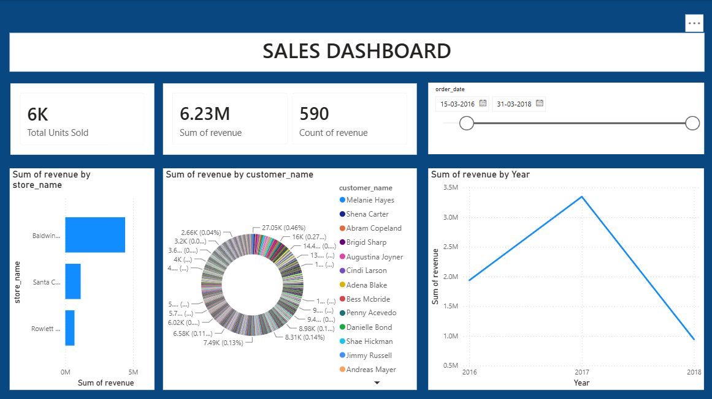
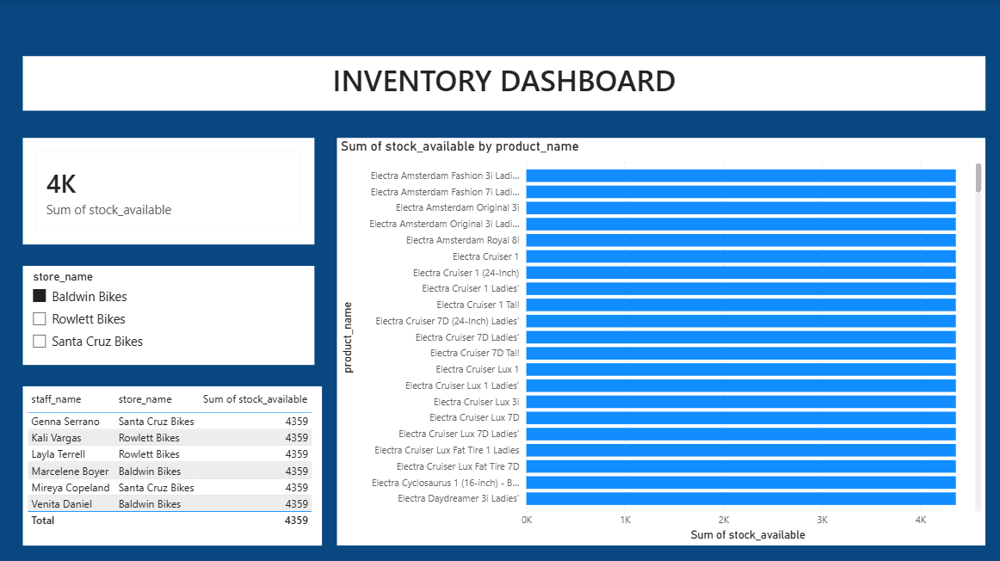
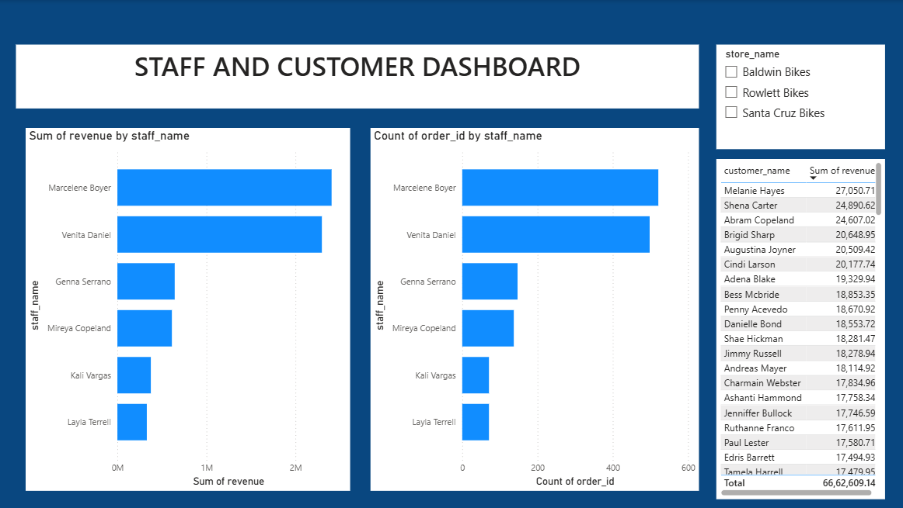
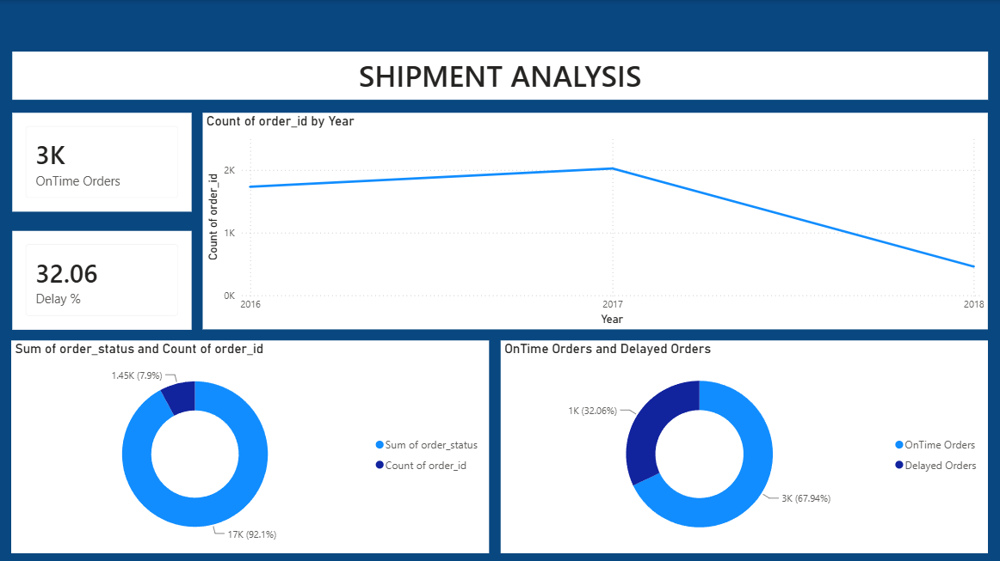

# 🛒 Retail Sales & Inventory Intelligence System

## 📌 Project Overview
The primary objective of this project is to transition a retail company from intuition-based decision-making to a fully data-driven ecosystem. This end-to-end business intelligence solution leverages SQL for relational database architecture and Power BI for dynamic dashboarding to optimize sales, inventory management, staff performance, and supply chain logistics.

## 📂 Repository Structure
* **`Dataset/`**: Contains the 9 raw CSV tables (orders, customers, products, brands, categories, stores, staffs, stocks, and order_items).
* **`SQL_Scripts/`**: 
  * `retail_sales_sql.sql`: DDL scripts for schema creation and Entity-Relationship mapping.
  * `retail_sales_queries.sql`: Advanced DML queries resolving core business problems and creating optimized SQL Views.
* **`Dashboard/`**: Contains the `Retail_Sales_Dashboard.pbix` file featuring all interactive data models and DAX measures.

---

## 🚀 Business Problems Solved
This project directly addresses critical operational bottlenecks:
1. **Sales Intelligence:** Identified top-selling products, profitable categories, and isolated weak-performing store locations.
2. **Inventory Optimization:** Built trackers to identify stores with excess stock vs. those facing immediate stock shortages.
3. **Staff & Customer Metrics:** Quantified staff productivity/revenue contribution and mapped loyal customer buying behaviors.
4. **Shipment & Logistics:** Tracked order fulfillment times to identify delayed shipments and improve delivery reliability.

---

## 🛠️ Project Workflow & Methodology

### 1. Data Engineering & Database Architecture (SQL)
* **Schema Design:** Imported raw CSVs into a relational SQL database, establishing primary and foreign key relationships across 9 distinct tables.
* **Data Cleaning:** Handled missing values, standardized formats, and eliminated duplicates directly within SQL/Power Query.
* **View Creation:** Developed optimized SQL `CREATE VIEW` statements (e.g., `sales_summary`) to feed clean, pre-joined data seamlessly into Power BI.

### 2. Interactive Business Intelligence (Power BI)
Connected Power BI directly to the established SQL Views to ensure a scalable, automated data pipeline. 

* **Sales Dashboard:** Tracks total revenue, category breakdowns, and monthly sales trends.
* **Inventory Dashboard:** Monitors active stock levels, triggers low-inventory warnings, and evaluates product availability.
* **Staff & Customer Dashboard:** Highlights top regional customers and ranks staff performance metrics.
* **Shipment Dashboard:** Analyzes delivery times and isolates logistical bottlenecks.

---

## 📊 Dashboard Previews

**1. Enterprise Sales Overview** 

**2. Inventory & Stock Management** 

**3. Staff Performance & Customer Loyalty** 

**4. Shipment & Delivery Analysis** 

---

## 💡 Final Strategic Recommendations
Based on the data analysis, the following actionable business strategies are recommended:
* **Inventory Balancing:** Immediately redistribute excess stock to high-demand regions and implement automated low-stock alerts.
* **Targeted Marketing:** Execute targeted promotional campaigns on slow-moving inventory items to clear warehouse space.
* **Performance Incentives:** Reward top-performing staff members identified in the dashboard and implement training programs for underperforming regions.
* **Logistics Overhaul:** Investigate the specific regions facing shipment delays and renegotiate terms with local delivery partners to reduce late product arrivals.
